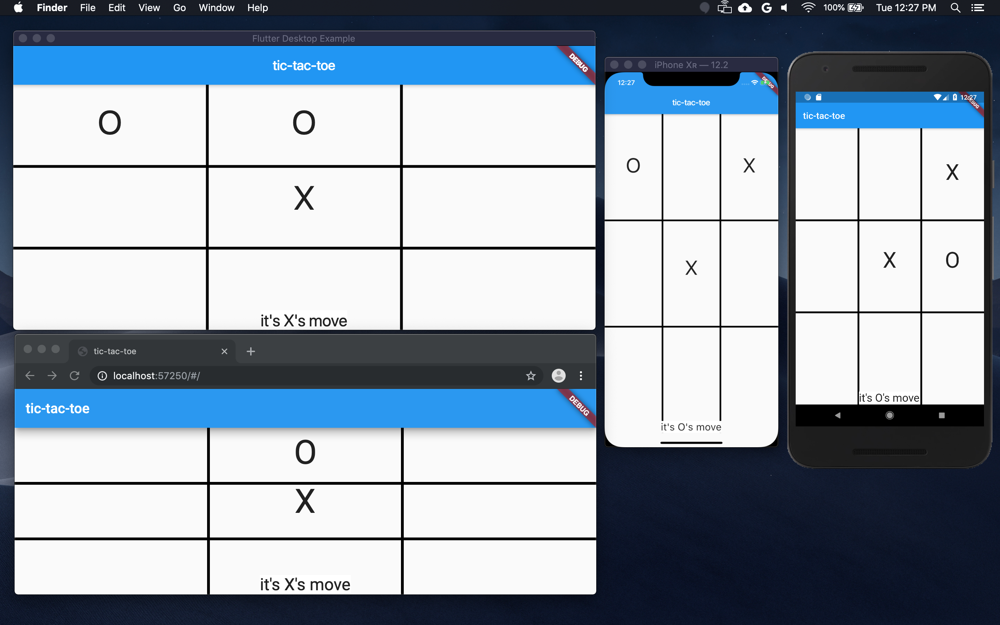

# Flutter Multi-Platform Tic-Tac-Toe

A multi-platform Flutter sample game of tic-tac-toe.

## The Talk
I gave a talk at [the Portland-Area .NET User Group](http://padnug.org) recently, built this app in a live coding demo to show off Flutter and then did a bit of hackery to make it work across mobile, desktop and web. If you're interested in how the code was created, [check out the talk on YouTube](https://youtube.com/watch?v=bbaezQE1M2U).

## The Code
[Get Flutter working on your machine first](https://flutter.dev/docs/get-started/install), download [the code](https://github.com/csells/flutter_mplat_ttt) and then run the following commands:

```shell
$ flutter run -d iphone   # or whatever matches your iOS simulator
$ flutter run -d android # or whatever matches your Android emulator
$ flutter run -d macos
$ flutter run -d chrome
```
Here's a composite of the app running on iOS, Android, desktop (macOS) and web:



## Caveat
The multi-platform hackery part of this sample code is likely to get stale fast! For the latest instructions, see [the flutter_desktop_embedding repo](https://github.com/google/flutter-desktop-embedding) and [the flutter_web repo](https://github.com/flutter/flutter_web).

## The Trick
As of this writing, the trick to get a simple, plugin-less Flutter app to run across mobile, macOS and web from a single source code base is a bit of hackery in the main() function of your app:

```dart
import 'dart:io';
import 'package:flutter/foundation.dart' show debugDefaultTargetPlatformOverride;

void main() {
  if (!identical(0, 0.0) && Platform.isMacOS)
    debugDefaultTargetPlatformOverride = TargetPlatform.iOS;
  runApp(MyApp());
}

// the rest of your app goes here...
```

As described in the [FDE Flutter Application Requirements](https://github.com/flutter/flutter/wiki/Desktop-shells#flutter-application-requirements), on the current desktop bits, debugDefaultTargetPlatformOverride must be set to TargetPlatform.iOS if you're running on macOS and TargetPlatform.Android otherwise. If you don't have code that does this before your Flutter code runs, you'll get a run-time exception and a blank screen when you run the app on the desktop.

However, the web runtime doesn't like the use of dart:io at all, even the Platform.isMacOS property, and using it will cause an exception at run-time.

So, to keep the code from causing a run-time exception anywhere, we use a little hackery relying on the fact that Flutter for web generates JavaScript to make Dart run in the browser and that numbers are implemented differently in JavaScript then in Dart. In the fullness of time, none of this is necessary, but it's a pretty cool hack for now.

Enjoy!